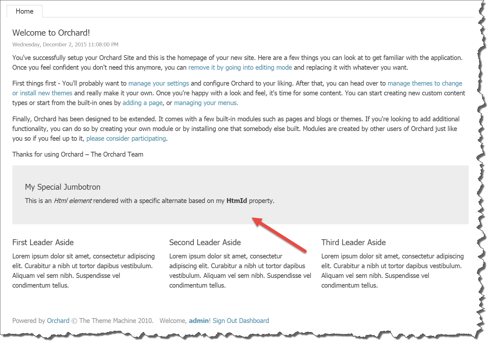

## 9. Theming ##
Orchard has a powerful theming story that allows theme developers endless freedom to skin pretty much everything. To understand how theming works, it is crucial to understand an Orchard-specific concept called *Shapes*.

### Introduction to Shapes ###
Shapes. They are at the heart of the Orchard rendering engine, and is what makes the theming so brilliantly flexible. But dude, what the frack is a shape?

Although the term "shape" may sound like something vague and abstract (it did so to me, anyway), here is a clear definition that made it very concrete in my mind:

*A shape is a dynamic object that serves as the view model for a given Razor view.*

> When we talk about Razor views that render Shape objects, we typically call those views *shape templates*. In other words, a shape template is a Razor view that renders (or displays) a shape.
> However, although shapes are typically rendered using a Razor view, that is just one implementation of it. Shapes can in fact be rendered using any mechanism you can think of. Another implementation of shape rendering is called **shape methods**. Shape methods are C# methods that write markup to a `TextWriter` or return a `string`, which is then written to the `HTTP Response` object.

> So, although we can say that Razor views and shape methods are shape templates, the other way around is not necessarily true: a shape template is not automatically a Razor view or a shape method. The shape template is determined using a so called *shape table*, which we'll see shortly.   

Aha.
While that certainly helps, it also leads to further questions, such as:

1. What is the .NET type of a shape?
2. How is the shape template determined and rendered?
3. Why use dynamic objects as view models instead of static types?

We'll get to answer all of these questions, but first let me share some of my musing with you of my early days with Orchard theming.

I remember well the early days when I created my own theme with Orchard based on a Photoshop design, being baffled at how to customize certain aspects of certain parts created by Orchard. How do I determine what view to override? I discovered the Shape Tracer, which was helpful. But what is the difference between a child shape and a property on that shape? Are all shapes created first before the rendering phase starts?

[I was clueless](http://weblogs.asp.net/bleroy/orchard-list-customization-first-item-template) and in [serious need](http://weblogs.asp.net/bleroy/taking-over-list-rendering-in-orchard) of [help](http://weblogs.asp.net/bleroy/switching-the-layout-in-orchard-cms). [Bertrand Leroy](https://twitter.com/bleroy), father of the Orchard Project, tried to answer the questions I had. Although shapes seem so simple to me know, I remember fondly how much of a black art they seemed to me at the time. But not anymore. And, you too, my dear Padawan, will come to see the beauty and simplicity of the nature of shapes and master the art of theming.

OK enough of that. Let's have a look at the questions. 

### Demystifying Shapes ###
In order to grasp the bigger picture, It may help to understand the anatomy of shapes, when they are created and how they are rendered.

#### What is the .NET type of a shape? ####
All shape objects are instances of the `Shape` class, which itself implements the `IShape` interface and inherits from `Composite`, which in turn inherits from the .NET `DynamicObject` class (see *diagram 1*).
The `Composite` class implements the dynamic behavior when instance of its type are typed as `dynamic`. This is not unlike the way the .NET `ExpandoObject` works, where you can dynamically add members to a dynamic instance at run-time.


So there you have it. We can dynamically add properties and child shapes to shapes at run-time. Every shape has a `Metadata` property, which contains information such as the shape's `Name`.  

#### How is the shape template determined and rendered? ####
Once a shape is created using the `IShapeFactory`, it needs to be rendered at some point.
To render a shape, Orchard relies on the `IDisplayManager`. Before that thing can render a shape, it needs to know what shape template to use. In order to determine that, it uses three things to find the template to use:

1. The shape's Name (stored in Metadata).
2. The shape's Alternates (also stored in Metadata).
3. A shape table to get a shape binding based on either the shape name or one of the shape alternates.

The shape binding contains a delegate that will perform the actual rendering (using the Razor view engine, a shape method, or potentially something else entirely).

If the shape table matches with any of the alternates, the first match is used. If no alternates match, a binding based on the shape Name is returned. If no binding was found, an exception is thrown.

> If you try to render a shape for which no binding exists, an `OrchardException` *"Shape type {0} not found"* will be thrown.

Once a binding is found, the display manager invokes its `Binding` property, which is of type `Func<DisplayContext, IHtmlString>`.

The shape rendering process essentially boils down to:

1. Given a shape object, get me a function to render that shape (Razor or shape method).
2. Invoke that function.

In practice, all we need to do to render a shape is invoke `@Display` from a Razor view, passing in an instance of a shape. The `Display` property of a Razor view ultimately invokes `IDisplayManager.Execute`, which does the shape table look-up as just described.

> An important fact to realize is that shape creation and shape rendering are two distinct operations.
> Another important fact to realize is that it is a quite common scenario when a given shape is rendered, its shape template could create additional shapes.

#### Why use dynamic objects as view models instead of static types? ####
One concern with dynamic types is the loss of intellisense, so why use dynamic types instead of strongly-typed .NET types?

The main reason a dynamic models was chosen is because of the dynamic nature of the shape hierarchy constructed at run-time. Orchard is a modular CMS, and shapes could be created and added and even modified from anywhere. That level of flexibility is hard to implement with static types. It would be doable, but it most likely means working with `object` instances and `Dictionary` instances, ultimately making it even more complex to work with.

As it turns out, using dynamic shapes makes the system much more flexible and elegant, despite the loss for intellisense (which wouldn't be helpful anyway when working with dictionaries).    

### Elements and Shapes ###
Shapes can be created from anywhere and at any point in the request pipeline, including controllers, action filters as well as from views. This also means while a shape is being rendered by a view, that view itself could create and render more shapes.

Ultimately it all boils down to two things:

1. Creating shapes
2. Rendering them.

As is the case with any proper Orchard module, the Layouts module too uses shapes to render elements. The way this works is by simply invoking the `DisplayElement` method on the `IElementDisplay` service. 

Similar to the `IContentDisplay` service that turns a `ContentItem` into a `Content` shape, the `IElementDisplay` services turns an `Element` into an `Element` shape.

If the specified element has child elements, the service recursively creates shapes for them as well, adding those shapes to their parent shape.

When creating the `Element` shape, the system also adds a bunch of **alternates** to the metadata of that shape. Out of the box, the following alternates are added:

- `Elements_{typeName}`
- `Elements_{typeName}_{displayType}`
- `Elements_{typeName}__{category}`
- `Elements_{typeName}_{displayType}__{category}`

The **typeName** is the .NET type name (without the namespace) of the element class, `Html` for example.
The **category** is the name of the category to which the element descriptor is assigned, "Content" for example.
The **displayType** is the value provided for the `displayType` argument of `IElementDisplay.DisplayElement`.

When Orchard is instructed to render a shape, it needs to determine which shape template to use. If it finds a shape template matching one of the alternates (where the last added alternate is considered the most specific one), it uses that template.

> Orchard maps alternate name syntax to filename syntax by replacing underscores with dots and double underscores with hyphens.

For example, given a **displayType** of "Design" and a **category** of "Content", these alternates map to the following Razor view filenames:

- *Elements.Html.cshtml* or *Elements/Html.cshtml*
- *Elements.Html.Design.cshtml* or *Elements/Html.Design.cshtml*
- *Elements.Html-Content.cshtml* or *Elements/Html-Content.cshtml*
- *Elements.Html-Content.Design.cshtml* or *Elements/Html-Content.Design.cshtml*

Notice that you can use a slash instead of a dot after "Element". This conveniently enables you to organize your Element shape templates in an "Elements" folder (figure 68).


#### Overriding Element Shape Templates ####
Out of the box, Orchard takes care of rendering the Element shapes for you. Most of the times, you don't need to override these templates, except for a few of them. For example, if you're creating a theme based on a CSS Grid framework such as Bootstrap, you will want to override the Grid.cshtml and Column.cshtml shape templates in order to provide the appropriate CSS classes that Bootstrap expects for container and column elements. Another example may be where you have a specific requirement for rendering additional HTML around an element.

To override a shape template, simply copy one of the existing templates from the Layouts module into the Views folder of your theme and apply your customization.

#### Custom Alternates ####
As with any shape, you have the option of adding custom alternates to the metadata of a shape, allowing you finegrained control over what shape template to use based on conditions provided by yourself. Let's say you wanted to provide an alternate based on the HTML ID property of an element so that you can use a specific shape template for certain elements with certain IDs. To do so, you would implement the `IShapeTableProvider` interface and add an `OnDisplaying` event handling function from where you add your alternates. Let's see how that works.

### Demo: Creating custom alternates for Element shapes ###
For this demo you will need to either create a custom module or add the code to your theme project. It is considered best-practice to add code to a module instead of a theme. One advantage of that approach is that you'll be able to reuse your code regardless of the active theme. I will assume that you know how to create a module. If not, there are excellent resources on the web that demonstrate how to do this, including Orchard's official documentation.

Our shape table provider class that adds an alternate based on an element's HTML ID property looks like this:

```
using System;
using Orchard.DisplayManagement.Descriptors;
using Orchard.Layouts.Framework.Elements;
using Orchard.Utility.Extensions;

namespace MyModule.Shapes {
    public class CustomElementShapes : IShapeTableProvider {
        
        public void Discover(ShapeTableBuilder builder) {
            builder.Describe("Element").OnDisplaying(context => {
                // The shape being displayed contains a reference to the Element instance for which that shape was created.
                var element = (Element)context.Shape.Element;

                // Get the HtmlId value of the element.
                var htmlId = element.HtmlId;

                // Don't add custom alternates if no value was provided.
                if (String.IsNullOrWhiteSpace(htmlId))
                    return;

                var typeName = element.GetType().Name;
                htmlId = htmlId.ToSafeName();

                // Example: Elements/Html-MyJumbotron.cshtml
                context.ShapeMetadata.Alternates.Add($"Elements_{typeName}__{htmlId}");
            });
        }
    }
}
```
*Code Snippet 9.1 - The CustomElementShapes class.*

What this code does is very straightforward. It describes the "Element" shape and adds a handler for the `OnDisplaying` event of shapes of that type. When that handler executes, it gets a reference to the actual `Element` instance for which the `IElementDisplay` service created a shape to be rendered. This is necessary so that we can get its configured `HtmlId` property. If no such value was specified, we do nothing and return. Otherwise, we construct an alternate using the element type name as well as its HtmlId value.


*Figure 9.2 - Every element has an HTML ID property*

Given that alternate, we can now provide specific shape templates by assigning an HTML ID to an element and providing a shape template in or theme based on our custom alternate for that HTML ID value.

Let's assume we wanted to be able to provide an HTML ID value of "MyJumbotron" to some `Html` element, so that we can provide a specific shape template in our theme for that element. All we need to do is create a Razor view in our theme's *Views* folder with the following filename: *Elements/Html-MyJumbotron.cshtml*. The contents of that file could be:

```
@*Using inline CSS for demo purposes.*@
@using (Script.Head()) {
    <style type="text/css">
        .jumbotron {
            padding: 2em;
            background: #ededed;
        }
    </style>
}
<div class="jumbotron">
    <h2>My Special Jumbotron</h2>
    @Html.Raw(Model.ProcessedContent)
</div>
```

Now when we add an Html element to our layout canvas and provide a value of *MyJumbotron* for its HTML ID property, we'll see the following result (I'm using the *TheThemeMachine* theme):


*Figure 9.3 - The custom shape template alternate is being used when rendering the Html element with HTML ID "MyJumbotron"* 

As you can see, shapes are a powerful aspect of Orchard, offering a lot of flexibility when it comes to theming.

### Content Part and Field Elements ###
In chapter 3 we were introduced to various element types and their categories, two of which being *Parts* and *Fields* elements. These elements allow the user to place content parts and fields attached to the current content type anywhere on the layout editor. See figure 9.4 for an example.


*Figure 9.4 - The TitlePart element enables the user to place the TitlePart anywhere on the layout.*

When you first start using Part and Field elements, you'll notice that these parts and fields are rendered at least twice on the front-end (see figure 9.5), which is not typically what we want. Before we see how to deal with this in a minute, let's go over why this is happening.


*Figure 9.5 - The Title Part is rendered twice: once using the default shape placement configuration, and once using the Title Part Element as placed on the canvas*

The reason this is happening is that out of the box, part and field shapes are configured to be placed in the Content zone using **Placement.info** files. A Placement.info file is an XML formatted file that contains placement configuration for shapes created by content part and field drivers. In addition to those shapes being placed, we also placed part and field elements onto the canvas, effectively rendering these parts and fields twice (or more, depending on the number of elements that were added).

To fix this, we need to tell Orchard to not render the shapes as configured by the default Placement.info files, since we are placing those things ourselves via the Layout Editor. The way to do this is by updating the Placement.info file of the current theme.

#### Updating Placement.info ####
Preventing a part or field shape from being rendered is easy: just specify an empty string or a hyphen as the value of the attribute representing the shape type. For example, let's say we wanted to place the **Title Part** shape onto our layout. Since the `TitlePartDriver` returns a shape called `Parts_Title`, we can add the following XML to our Placement.info file in our current theme:

```
<Placement>
   <Place Parts_Title="-" />
</Placement>
```

With that change, however, neither the default shape nor the shape created by the element is being displayed. This is because the part and field element drivers use the same mechanism as the `IContentDisplay` service to execute the part and field drivers and process the returned shapes by applying Placement.info.

To have the `Parts_Title` shape rendered by our element and not by the default content rendering pipeline, we need to add a `<Match DisplayType="Layout">` element for the **Layout** display type. The Layout display is used by the Part and Field element drivers to render a content part or field. Within that Match element we then configure the `Parts_Title` shape to be placed in the `Content` zone of the element. The final Placement.info configuration would look like this:

```
<Placement>
   <!-- Don't render the Parts_Title shape by default. -->
   <Place Parts_Title="Layout" />

   <!-- Except for Parts_Title shape being rendered using the "Layout" display type that is used by Layouts. -->
   <Match DisplayType="Layout">
        <Place Parts_Title="Content" />
    </Match>
</Placement>
```


With this placement configuration in place, we can now place the `TitlePart` anywhere on our layout without that part being rendered using the default placement


*Figure 9.6 - With the updated Placement.info configuration, the default title part shape is no longer rendered.*

The same principle applies to *Content Field Elements*.

### Bootstrap ###
Many websites thee days are built with CSS grid frameworks such as Bootstrap. Such frameworks make it easy to create grid-based layouts using DIV tags and certain CSS classes to define rows and columns. The Layouts module comes with a light-weight grid stylesheet out of the box, but when your Orchard theme is based on Bootstrap, you will definitely want to take advantage of those CSS classes. In this section we'll learn what shape templates to override and how to customize those templates to make them work. Although I'm using Bootstrap as an example, the principles shown apply to any other CSS grid frameworks (such as Foundation). The main differences will be the CSS class names used by each framework.

#### Analyzing which templates to override ####
In order to understand what needs to be overridden, we need to analyze the HTML output as generated by the Grid, Row and Column elements, since we use those to created grids. For example, take the following layout:


When rendered on the front-end using the default shape templates, the following HTML output is generated for this grid:

```
<div class="table">
   <div class="row">
      <div class=" span-12 cell"></div>
   </div>
   <div class="row">
      <div class=" span-6 cell"></div>
      <div class=" span-6 cell"></div></div>
   <div class="row">
      <div class="offset-3 span-3 cell"></div>
      <div class=" span-3 cell"></div>
   </div>
</div>
```

When we want the same grid structure using Bootstrap CSS, we would need something like the following HTML output:

```
<div class="container-fluid">
   <div class="row">
      <div class="col-xs-12"></div>
   </div>
   <div class="row">
      <div class="col-xs-6"></div>
      <div class="col-xs-6"></div></div>
   <div class="row">
      <div class="col-xs-offset-3 col-md-3"></div>
      <div class="col-xs-3"></div>
   </div>
</div>
```

Notice how the HTML structure itself can remain exactly the same. The only changes needed are the CSS classes being applied.

To change the CSS classes being used, we need to override the following shape templates from the `Orchard.Layouts` module:

- **Elements/Grid.cshtml** (Responsible for generating the `<div class="table">` tag)
- **Elements/Column.cshtml** (Responsible for generating the `<div class="span-{n} offset-{o} cell">` tag)
- **Parts.Layout.cshtml** (Responsible for including the default CSS grid stylesheet. See below section)

Since the **Row.cshtml** shape template renders the *row* CSS class already, there's no need to override that one.

However, we do need to override another shape template: **Parts.Layout.cshtml**. This is the root shape that renders the layout as well as includes the default CSS grid stylesheet. Since we're relying on Bootstrap CSS on the front-end, we need to override that template to prevent the default grid stylesheet from being included.

#### Overriding default templates ####
To achieve the desired HTML output, copy over the listed shape templates from the **Orchard.Layouts/Views** folder to the **Views** folder of your current theme. and update each template as follows:

*Views/Elements/Grid.cshtml*
```
@using Orchard.Layouts.Helpers
@{
    var tagBuilder = TagBuilderExtensions.CreateElementTagBuilder(Model);
    tagBuilder.AddCssClass("container"); // <-- Notice the use of the "container" class.
}
@tagBuilder.StartElement
@DisplayChildren(Model)
@tagBuilder.EndElement
```

*Views/Elements/Column.cshtml*
```
@using Orchard.Core.Shapes
@using Orchard.DisplayManagement.Shapes
@using Orchard.Layouts.Helpers
@{
    var columnSpan = (int?)Model.Width;
    var columnOffset = (int?)Model.Offset;
    var columnOffsetCss = columnOffset > 0 ? "col-xs-offset-" + columnOffset : default(string); // <-- Notice the use of the "col-xs-offset-{n}" class.
    var tagBuilder = TagBuilderExtensions.AddCommonElementAttributes(new OrchardTagBuilder("div"), Model);

    tagBuilder.AddCssClass(String.Concat("col-xs-", columnSpan)); // <-- Notice the use of the "col-xs-{n}" class.
    tagBuilder.AddCssClass(columnOffsetCss);
}
@if (!Model.Collapsed) {
    @tagBuilder.StartElement
    foreach (var item in CoreShapes.Order(Model)) {
        @Display(item)
    }
    @tagBuilder.EndElement
}
```

*Views/Parts.Layout.cshtml*
```
<!-- The only change here is the removal of the following line: -->
@*Style.Include("default-grid.css");*@

<div class="orchard-layouts-root">
    @Display(Model.LayoutRoot)
</div>
```

#### Responsive Layouts ####
CSS grid frameworks such as Bootstrap typically have support for *responsive design*. Responsive design in this context means handling various viewport sizes so that the layout looks good on any of them using so called *breakpoints*. A breakpoint is a certain viewport width in pixels. CSS has support for implementing breakpoints using *media queries*. Bootstrap implements a number of breakpoints using media queries. To target these breakpoints, it makes available the following family of column CSS class prefixes:

- **col-xs-** (Extra small viewports, e.g. smartphone devices)
- **col-sm-** (Small viewports, e.g. tablets)
- **col-md-** (Medium viewports, e.g. desktop computers and laptops)
- **col-lg-** (Large viewports, e.g. wide screens)

The idea behind these classes is that for example on larger viewports you may want to show cells horizontally, but stacked on smaller viewports. Such HTML could look like this:

```
<div class="row">
   <div class="col-xs-12 col-sm-8 col-md-6"></div>
</div>
```

Now, the layout editor does not know anything about responsive design. It simply lets you create a layout. It's up to you to determine the baseline layout, and specify any specific CSS classes on the Column elements to provide further control on smaller and larger viewports. In the sample templates overridden earlier, we used the *col-md-* CSS class prefix, which means we are targeting medium-sized viewports by default. To have a column span 12 columns on smaller viewports, we could specify a CSS class of *col-xs-12* on a column element that spans 6 columns by default. Let's see how this works.

#### Demo: Creating responsive layouts with Bootstrap ####
In this demo, we will see how to use the *CSS classes* setting on the *Column* elements to achieve the following responsiveness effect: on small viewports, a row with two columns should be equal in width (6+6), but for larger viewports we want the second column to be smaller than the first one (9+3). I will assume you have creates shape template overrides as explained in the *Overriding default temlates* section.

> For this demo I downloaded and installed the excellent Bootstrap theme called PJS.Bootstrap from the gallery.

With that in place, let's create a new Page content item with the following grid:


Since we used the **col-xs-** class prefix in our Column.cshtml template, the two columns of the second row will be sized equally, since we created the columns as 6 units each.

Next, to make the first column appear as 9 units wide and the second one as 3 units, we need to apply the following CSS classes to each column respectively:

- col-sm-9
- col-sm-3


Save these changes and check out the front end.
First, resize the browser window to simulate a very small view port:


Notice that both columns are equally sized, as designed using the Layout Editor.
Next, resize the browser window to simulate a larger viewport:


Notice how the columns are no longer equally sized. This is because the Bootstrap stylesheet defined a media query to implement a breakpoint for width > 768px, which let's the `.col-sm-` prefixed classes kick in. Since we applied two of such classes, they are now in effect.

The generated HTML output looks like this:

```
<div class="container">
   <div class="row">
      <div class="col-xs-12">
         ...
      </div>
   </div>
   <div class="row">
      <div class=" col-xs-6 col-sm-9">
         ...
      </div>
      <div class=" col-xs-6 col-sm-3">
         ...
      </div>
   </div>
</div>
```

So there you have it: responsive design using Orchard Layouts.

### Snippets ###
In chapter 3 we learned about *Snippet Elements*. They are elements dynamically discovered based on Razor views whose name follow a certain convention: Razor views that end with **Snippet.cshtml** are harvested as a Snippet element. For example, **ButtonSnippet.cshtml** would yield an element called **Button Snippet**.

As of Orchard 1.10 this feature was enhanced by yours truly to *provide parameterizable snippets*. A parameterized snippet enables users to add snippet elements to the layout editor and *configure these snippets with custom settings*.

To add settings to a snippet, all the theme developer needs to do is invoke an Html helper called `SnippetField`. This nifty helper serves two purposes:

1. To provide meta information to the element editor about the configurable field.
2. To read the configured value for the field when the element is being rendered.

The signature of the helper looks like this:  

```
SnippetFieldDescriptorBuilder SnippetField(this HtmlHelper htmlHelper, string name, string type = null) {}
```

As you can see, it accepts a *name* and a *type*. The name represents the technical name of the field, while the type represents the data type of the field. At the time of this writing, only one type is supported: *text*.
The method returns a thing called `SnippetFieldDescriptorBuilder` which enables the theme developer to provide more information to the snippet field using a fluent API, currently just a *DisplayName* and *Description*, both of which are used when presenting the user with the element editor dialog in the back-end.

Parameterized snippets are a great tool for theme developers to create custom elements without the need to write element classes. All they need to do is create a Razor view and provide the necessary markup.

To get a good understanding of what you can do with parameterized snippets, let's create one.

#### Demo: Parameterized Snippets ####
In this demo, we'll build a reusable, parameterized snippet called *JumbotronSnippet* with two fields: Caption and Text. The idea is that users can add any number of jumbotrons to their pages and provide a caption and a body text.

The first thing to do is create a view called "JumbotronSnippet.cshtml" in our theme and provide the following markup:

*Views/JumbotronSnippet.cshtml*
```
@using Orchard.Layouts.Helpers
@*Using inline CSS for demo purposes.*@
@using (Script.Head()) {
    <style type="text/css">
        .jumbotron {
            padding: 2em;
            background: #ededed;
        }
    </style>
}
<div class="jumbotron">
    <h2>@Html.SnippetField("Caption").DisplayedAs(T("Caption")).WithDescription(T("The caption of this jumbotron."))</h2>
    @Html.Raw(Html.SnippetField("Text").DisplayedAs(T("Text")).WithDescription(T("The body text of this jumbotron")))
</div>
```

Notice that I'm chaining the `DisplayedAs` and `WithDescription` methods. The fluent API prevents us from having to first instantiate a snippet field, initializing it with desired values, and then render it. 

With this snippet in place, all we need to do next is make sure that the *Layout Snippets* feature is enabled and add the `Jumbotron` element to our canvas.


Notice that as soon as you drag & drop a Jumbotron element to the page, the element editor dialog appears, showing the two fields as defined in the `JumbotronSnippet.cshtml` file:


As you can see, the editor took the information from the snippet field descriptors as created in the view and used it to render appropriate input controls.
Yeah, that's pretty awesome, even if I do say so myself.

Let's see how this looks on the front end:


### Summary ###
In this chapter, we learned about shapes, which are dynamic objects that serve as view models for shape templates. Shape templates take care of generating HTML, and can be implemented either using Shape methods or Razor views. We also learned about shape alternates, which are key to understanding how to customize shape templates in your custom theme.

We then looked at a specific category of elements: Part and Field elements. They provide the user with great control over where to place them on a canvas, however, it's the theme's responsibility to prevent the default shapes from being rendered using **Placement.info**.

Although the Layouts module comes with a default CSS grid stylesheet, many themes these days will come with their own CSS grid frameworks, such as the popular Bootstrap framework. We learned how to take advantage of such frameworks by overriding the Grid, Column and Parts.Layout shape templates.

We learned a bit about the responsive aspects of Bootstrap and how to take advantage of that using the Layout editor to gain control over column sizes depending on various breakpoints.

To learn more about Bootstrap and responsive grids, visit http://getbootstrap.com/css.

Finally, we demonstrated how snippets work and how we can parameterize them so that users can configure them from the layout editor. Snippets enable theme developers to create custom elements without having to write C# classes. All that's required is a Razor view and some markup. 

And that's actually it for part 2! In the first part we looked at the Layouts module from a user's perspective. In part two, we looked at the module from a theme developer's perspetive. In the third and final part, we'll do a deep dive and check this module out from a module developer's perspective and learn about all the extensibility points that the Layouts module has to offer. Fasten your seatbelt!   