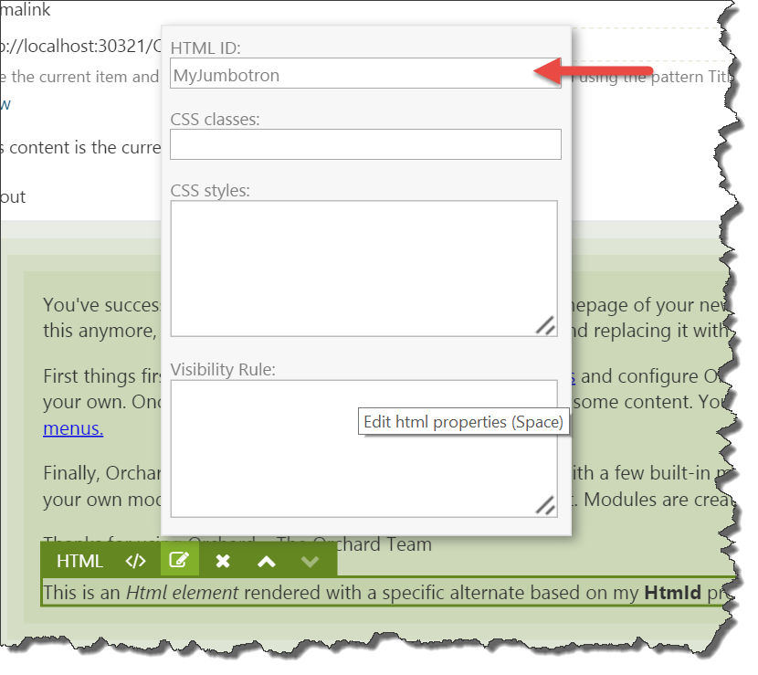

## 9. Theming
Orchard has a powerful theming story that allows theme developers endless freedom to customize pretty much everything. To understand how theming works, it is important to understand an Orchard-specific concept called *Shapes*.

### A Primer on Shapes
Shapes are at the heart of the Orchard rendering engine, and are dynamic objects that can be rendered into HTML. Shapes act as the view model for a given **shape template**, which is typically (but not necessarily) a Razor view. Shape templates can be implemented as:

- Razor views
- Shape methods
- Templates (a content type provided by **Orchard.Templates**)

> The above list can actually be extended with custom implementations of `IShapeTableProvider` and configuring the **binding** of a shape.

Key characteristics of shapes are that they:

- **Can be rendered.** This means that we can render a given shape into an HTML string. This is made possible because a shape carries information about what *shape templates* to use for rendering.
- **Can contain child shapes.** This means that we can build and render trees of shapes.
- **Are dynamic.** This means that we can add anything to a shape at runtime.

### Anatomy of a Shape
All shape objects are instances of the `Shape` class, which itself implements the `IShape` interface and inherits from `Composite`, which in turn inherits from the .NET `DynamicObject` class (see *diagram 1*).
The `Composite` class implements the dynamic behavior when typed as `dynamic`. This is not unlike the way the .NET `ExpandoObject` works, where you can dynamically add members to a dynamic instance at run-time, using an internal dictionary to store members and their values.


Bottom line is, we can dynamically add properties and child shapes to shapes at run-time. Every shape has a `Metadata` property, which contains information such as the shape's `Name`.

So a shape is a dynamic object. How is it related to rendering?

### Shape Templates
Once a shape is created using the `IShapeFactory`, it needs to be rendered at some point.
To render a shape, Orchard relies on a service called `IDisplayManager`. Before it can render a shape, it needs to know what shape template to use. In order to determine that, it uses three pieces of information to find the template to use:

1. The shape's Name (stored in Metadata).
2. The shape's Alternates (also stored in Metadata).
3. A shape table to get a shape binding based on either the shape name or one of the shape alternates.

The shape binding contains a delegate that will perform the actual rendering (which could be using the Razor view engine, a shape method, or potentially something else entirely).

If the shape table matches with any of the alternates, the first match is used. If no alternates match, a binding based on the shape Name is returned. If no binding was found, an exception is thrown.

> If you try to render a shape for which no binding exists, an `OrchardException` *"Shape type {0} not found"* will be thrown.

Once a binding is found, the display manager invokes its `Binding` property, which is of type `Func<DisplayContext, IHtmlString>`.

The shape rendering process essentially boils down to:

1. Given a shape object, get me a function to render that shape (Razor view or shape method).
2. Invoke that function and emit the returned HTML string.

So that's how it works in a nutshell from a technical point of view.
In practice, all we need to do to render a shape is invoke `@Display` from a Razor view, passing in an instance of a shape. The `Display` property of a Razor view ultimately invokes `IDisplayManager.Execute`, which does the shape table look-up as described.

### Elements and Shapes
Shapes can be created from anywhere and at any point in the request pipeline, including controllers, action filters as well as from views. This also means that while a shape is being rendered by a view, that view itself could create and render more shapes.

The Layouts module too uses shapes, to render elements.
Similar to the `IContentDisplay` service that turns a **ContentItem instance** into a **Content shape**, the `IElementDisplay` services turns an **Element instance** into an **Element shape**.

If the specified element has child elements, the service recursively creates shapes for them as well, adding those shapes to their parent shape.

When creating the **Element** shape, the system also adds a default set of **alternates** to the metadata of that shape. Out of the box, the following alternates are added:

- Elements_{typeName}
- Elements_{typeName}_{displayType}
- Elements_{typeName}__{category}
- Elements_{typeName}_{displayType}__{category}

The **typeName** is the .NET type name (without the namespace) of the element class, `Html` for example.
The **category** is the name of the category to which the element descriptor is assigned, **"Content"** for example.
The **displayType** is the value provided for the `displayType` argument of `IElementDisplay.DisplayElement`.

When Orchard is instructed to render a shape, it needs to determine which shape template to use. If it finds a shape template matching one of the alternates (where the last added alternate is considered the most specific one), it uses that template.

> Orchard maps alternate name syntax to filename syntax by replacing underscores with dots and double underscores with hyphens. Check out the documentation for how this works, or my blog post at http://www.ideliverable.com/blog/a-closer-look-at-content-types-drivers-shapes-and-placement

For example, given a **displayType** of **"Design"** and a **category** of **"Content"**, these alternates map to the following Razor view filenames:

- *Elements.Html.cshtml* or *Elements/Html.cshtml*
- *Elements.Html.Design.cshtml* or *Elements/Html.Design.cshtml*
- *Elements.Html-Content.cshtml* or *Elements/Html-Content.cshtml*
- *Elements.Html-Content.Design.cshtml* or *Elements/Html-Content.Design.cshtml*

Notice that you can use a slash instead of a dot after "Element". This conveniently enables you to organize your Element shape templates in an "Elements" folder (figure 9.1).


### Overriding Element Shape Templates
Out of the box, Orchard takes care of rendering the Element shapes for you. Most of the times, you don't need to override these templates, except for a few of them. For example, if you're creating a theme based on a CSS Grid framework such as Bootstrap, you will want to override the **Grid.cshtml** and **Column.cshtml** shape templates in order to provide the appropriate CSS classes that Bootstrap expects for container and column elements. Another example may be where you have a specific requirement for rendering additional HTML around an element.

To override a shape template, simply copy one of the existing templates from the Layouts module into the Views folder of your theme and apply your customizations.

### Custom Alternates
As with any shape, you have the option of adding custom alternates to the metadata of a shape, allowing you fine-grained control over what shape template to use based on conditions provided by yourself. Let's say you wanted to provide an alternate based on the HTML ID property of an element so that you can use a specific shape template for certain elements with certain IDs. To do so, you would implement the `IShapeTableProvider` interface and add an `OnDisplaying` event handling function from where you add your alternates.

Let's see how that works.

#### Trying it out: Creating Custom Alternates for Element Shapes
For this example you will need to either create a custom module or add the code to your theme project. One advantage of adding code to a module instead of a theme is that you'll be able to reuse your code regardless of the active theme, but if your code is specific to the theme then that is fine too.

The following code snippet demonstrates a shape table provider class that adds an alternate based on the element's HTML ID property:

```
using System;
using Orchard.DisplayManagement.Descriptors;
using Orchard.Layouts.Framework.Elements;
using Orchard.Utility.Extensions;

namespace MyModule.Shapes {
    public class CustomElementShapes : IShapeTableProvider {
        
        public void Discover(ShapeTableBuilder builder) {
            builder.Describe("Element").OnDisplaying(context => {
                // The shape being displayed contains a reference to the Element instance for which that shape was created.
                var element = (Element)context.Shape.Element;

                // Get the HtmlId value of the element.
                var htmlId = element.HtmlId;

                // Don't add custom alternates if no value was provided.
                if (String.IsNullOrWhiteSpace(htmlId))
                    return;

                var typeName = element.GetType().Name;
                htmlId = htmlId.ToSafeName();

                // Example: Elements/Html-MyJumbotron.cshtml
                context.ShapeMetadata.Alternates.Add($"Elements_{typeName}__{htmlId}");
            });
        }
    }
}
```
*Code Snippet 9.1 - The CustomElementShapes class.*

The above shape table provider describes the **Element** shape type and adds a handler for the `OnDisplaying` event of shapes of that type. When that handler executes, it gets a reference to the actual `Element` instance for which the `IElementDisplay` service created a shape to be rendered. This is necessary so that we can get its configured `HtmlId` property. If no such value was specified, we do nothing and return. Otherwise, we construct an alternate using the element type name as well as its HtmlId value.


*Figure 9.2 - Every element has an HTML ID property*

Given that alternate, we can now provide specific shape templates by assigning an HTML ID to an element and providing a shape template in or theme based on our custom alternate for that HTML ID value.

Let's say we wanted to be able to provide an HTML ID value of **"MyJumbotron"** to an **Html** element, so that we can provide a specific shape template in our theme for just that element. All we need to do is create a Razor view in our theme's *Views* folder with the following filename: **Elements/Html-MyJumbotron.cshtml**. The contents of that file could be:

```
@*Using inline CSS for demo purposes.*@
@using (Script.Head()) {
    <style type="text/css">
        .jumbotron {
            padding: 2em;
            background: #ededed;
        }
    </style>
}
<div class="jumbotron">
    <h2>My Special Jumbotron</h2>
    @Html.Raw(Model.ProcessedContent)
</div>
```

Now when we add an Html element to our layout canvas and provide a value of **MyJumbotron** for its HTML ID property, we'll see the following result (using the *TheThemeMachine* theme):


*Figure 9.3 - The custom shape template alternate is used when rendering the Html element with HTML ID "MyJumbotron"* 

### Content Part and Field Elements
In chapter 3 we were introduced to various element types and their categories, two of which being *Parts* and *Fields* elements. These elements allow the user to place content parts and fields attached to the current content type anywhere on the layout editor.


*Figure 9.4 - The TitlePart element enables the user to place the TitlePart anywhere on the layout.*

When you first start using Part and Field elements, you'll notice that these parts and fields are rendered at least twice on the front-end (see figure 9.5), which is not typically what we want:


*Figure 9.5 - The Title Part is rendered twice: once using the default shape placement configuration, and once using the Title Part Element as placed on the canvas*

The reason why this happens is because that out of the box, part and field shapes are configured to be placed in the Content zone using **Placement.info** files. A Placement.info file is an XML formatted file that contains placement configuration for shapes created by content part and field drivers. In addition to those shapes being placed, we also placed part and field elements onto the canvas, effectively rendering these parts and fields twice or more, depending on how many elements that were added.

To fix this, we need to tell Orchard to not render the shapes as configured by the default Placement.info files, since we are placing those things ourselves via the layout editor. The way to do this is by updating the Placement.info file of the current theme, as we'll see next.

#### Updating Placement.info
Preventing a part or field shape from being rendered is easy: just specify an empty string or a hyphen as the value of the attribute representing the shape type. For example, let's say we wanted to place the **Title Part** shape onto our layout. Since the `TitlePartDriver` returns a shape called **Parts_Title**, we can add the following XML to our Placement.info file in our current theme:

```
<Placement>
   <Place Parts_Title="-" />
</Placement>
```

With that change, however, neither the default shape nor the shape created by the element is being displayed. This is because the part and field element drivers use the same mechanism as the `IContentDisplay` service to execute the part and field drivers and process the returned shapes by applying Placement.info.

What we need to do instead is add a `<Match DisplayType="Layout">` element for the **Layout** display type. The Layout display is used by the Part and Field element drivers to render a content part or field. Within that Match element we then configure the `Parts_Title` shape to be placed in the `Content` zone of the element. The final Placement.info configuration would look like this:

```
<Placement>
   <!-- Don't render the Parts_Title shape by default. -->
   <Place Parts_Title="Layout" />

   <!-- Except for Parts_Title shape being rendered using the "Layout" display type that is used by Layouts. -->
   <Match DisplayType="Layout">
        <Place Parts_Title="Content" />
    </Match>
</Placement>
```

With this placement configuration in place, we can now place the **Title Part** anywhere on our layout without that part being rendered using the default placement


*Figure 9.6 - With the updated Placement.info configuration, the default title part shape is no longer rendered.*

The same works for *Content Field Elements*.

### Summary
In this chapter, we learned about shapes, which are dynamic objects that serve as view models for shape templates. Shape templates take care of generating HTML, and can be implemented either using Shape methods or Razor views. We also learned about shape alternates, which are key to understanding how to customize shape templates in your custom theme.

We then looked at a specific category of elements: Part and Field elements. They provide the user with control over where to place them on a canvas. However, the theme's Placement.info file needs to be updated to prevent the default shapes from being rendered into their default zones.   